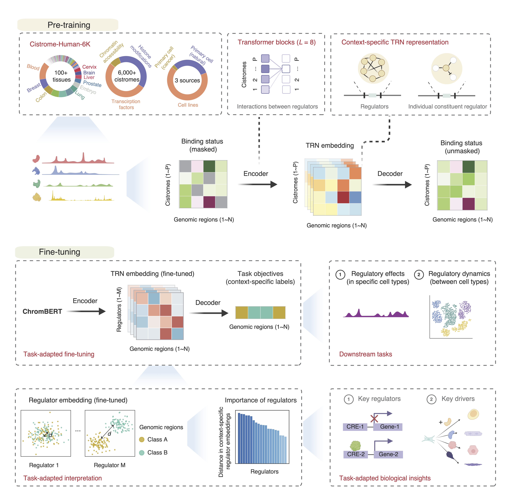

# ChromBERT: A pre-trained foundation model for context-specific transcription regulatory network 
[](https://chrombert.readthedocs.io/en/)
[](https://www.gnu.org/licenses/gpl-3.0)
[](https://chrombert.readthedocs.io/en/)

**ChromBERT** is a pre-trained deep learning model designed to capture the genome-wide co-association patterns of approximately one thousand transcription regulators, thereby enabling accurate representations of context-specific transcriptional regulatory networks (TRNs). As a foundational model, ChromBERT can be fine-tuned to adapt to various biological contexts through transfer learning. This significantly enhances our understanding of transcription regulation and offers a powerful tool for a broad range of research and clinical applications in different biological settings.



## Installation
ChromBERT is compatible with Python versions 3.8 or higher and requires PyTorch 2.0 or above, along with FlashAttention-2. These dependencies must be installed prior to ChromBERT.

#### Installing PyTorch 
Follow the detailed instructions on [PyTorch’s official site](https://pytorch.org/get-started/locally/) to install PyTorch according to your device and CUDA version specifications.

**Note: ChromBERT has been tested with Python 3.9+ and Torch 2.0 to 2.4 (inclusive). Compatibility with other environments is not guaranteed.**  

#### Installing FlashAttention-2
Execute the following commands to install the requried packages and [FlashAttention-2](https://github.com/Dao-AILab/flash-attention).
```shell
# install the required packages for FlashAttention-2
pip install packaging
pip install ninja

pip install flash-attn==2.4.* --no-build-isolation # FlashAttention-3 is not supported yet, please install FlashAttention-2
```

#### Installing ChromBERT
Clone the repository and install ChromBERT using the commands below:
```shell
git clone https://github.com/TongjiZhanglab/ChromBERT.git
cd ChromBERT
pip install .
```

Then download required pre-trained model and annotation data files from Hugging Face to ~/.cache/chrombert/data.
```shell
chrombert_prepare_env
```

Alternatively, if you're experiencing significant connectivity issues with Hugging Face, you can try to use the `--hf-endpoint` option to connect to an available mirror of Hugging Face for you.
```shell
chrombert_prepare_env --hf-endpoint <Hugging Face endpoint>
```

#### Verifying Installation
To verify installation, execute the following command:
```python
import chrombert
```


## Usage

For detailed information on usage, please checkout the documentations and tutorials at [chrombert.readthedocs.io](https://chrombert.readthedocs.io/en/latest/).


## Pre-trained Model Zoo

ChromBERT has been initially trained on the human Cistrome-Human-6K dataset at 1-kb resolution. Currently available pre-trained models include:
| Model Name                | Description                                              | Download Link                                                                                     |
| :------------------------ | :------------------------------------------------------- | :------------------------------------------------------------------------------------------------ |
| Human-6K-1kb | Pre-trained on Cistrome-Human-6K dataset at 1-kb resolution | [Download](https://huggingface.co/datasets/TongjiZhanglab/chrombert) |
| Mouse-5K-1kb | Pre-trained on Cistrome-Mouse-5K dataset at 1-kb resolution | [Download](https://huggingface.co/datasets/TongjiZhanglab/chrombert) |

Note: Models can also be downloaded via the `chrombert_prepare_env` command, as outlined in the installation section.

## Fine-tuning ChromBERT for downstream tasks

Explore detailed examples of how to fine-tune ChromBERT for downstream tasks such as prompt-enhanced fine-tuning for generative prediction, and analyses focused on locus specificities and cellular dynamics of TRNs, by visiting our examples page at [chrombert.readthedocs.io](https://chrombert.readthedocs.io/en/latest/).

## Citing ChromBERT

Our work is ongoing and contributions are continually being made.